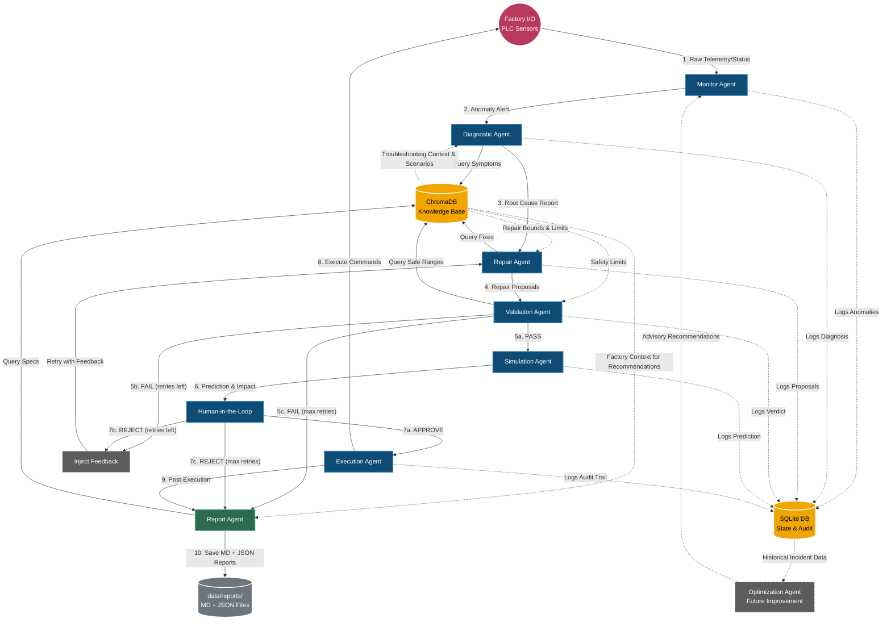

# Smart PLC Assistant: Agent Architecture & Flow

This diagram illustrates how the 8 core agents connect to each other, the factory, and the databases. The pipeline is orchestrated by LangGraph's conditional edges — there is no separate supervisor node.

