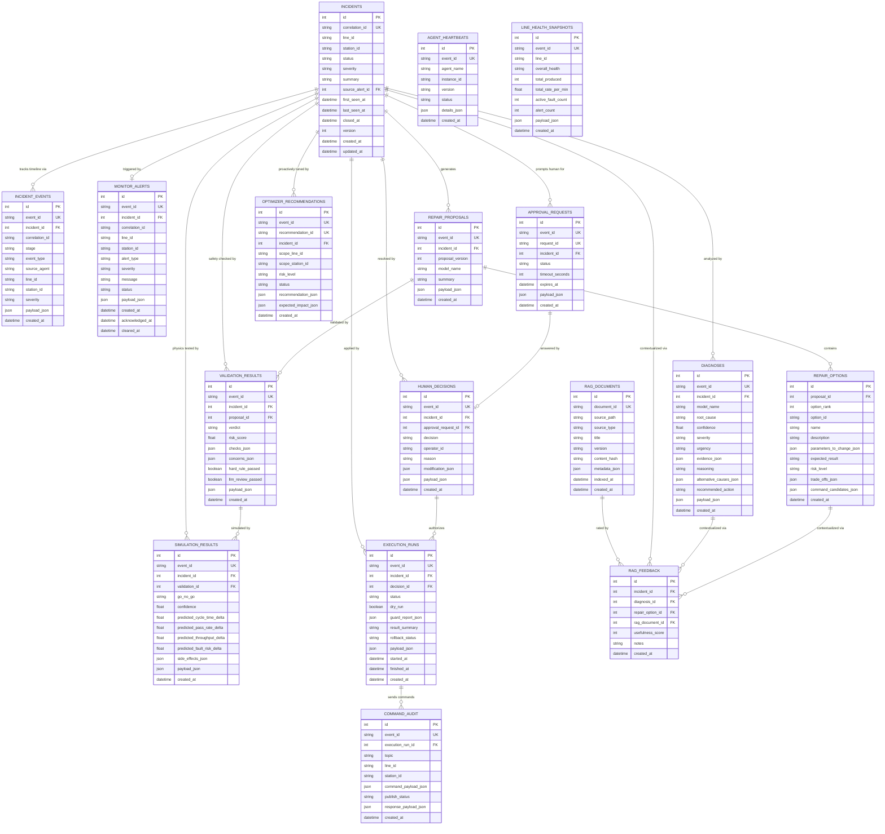

# Smart PLC Assistant — Database Schema & Architecture

> This document focuses specifically on the SQLite database schema, the Entity Relationship Diagram, table constraints, and exactly how the multi-agent system interacts with the database.

---

## 1. Entity Relationship Diagram (ERD)

The database schema is highly relational. The `incidents` table acts as the central hub for the multi-agent pipeline. As an incident progresses, each specialized agent writes its output to a child table linked by `incident_id`.

**Legend:**
*   **PK (Primary Key):** The unique ID number for a specific row in a table.
*   **FK (Foreign Key):** A reference linking a row in one table to the Primary Key of a *different* table. This is how tables connect to each other.
*   **UK (Unique Key):** A column that is guaranteed to have a completely unique value. In our system, UKs (like `event_id` and `correlation_id`) are used to ensure the AI agents don't accidentally process or save the exact same event twice.

---

## 2. Table Descriptions & Agent Usage

### 2.1 The Core Incident Hub

#### 1. `incidents`
*   **What it includes:** Core incident state (`status`, `severity`), factory location (`line_id`, `station_id`), and tracking timestamps (`first_seen_at`, `closed_at`).
*   **Why it's built:** To act as the central state machine and hub for a factory anomaly. It provides a single source of truth for the current status of any issue.
*   **How Agents Use It:** The **Monitor Agent** creates the incident. As other agents (Diagnostic, Repair, Validator, Simulator, Execution) finish their jobs, they update the `status` column to push the workflow forward (e.g., `DIAGNOSED` -> `REPAIR_READY` -> `SIMULATED`).
*   **Relationships:** It is the "Main Table". Almost every other table in the system connects back to it via the `incident_id` foreign key.

#### 2. `incident_events`
*   **What it includes:** The timeline of actions taken, including the `event_type`, the `source_agent` that took the action, and a `payload_json` of the event data.
*   **Why it's built:** To maintain an append-only timeline and audit log of everything that happens during an incident lifecycle.
*   **How Agents Use It:** **Every agent** in the system appends a row to this table whenever it performs an action. It serves as a historical ledger used by the Supervisor agent to understand full context.
*   **Relationships:** Connects directly to the main `incidents` table via `incident_id`.

---

### 2.2 The Agent Pipeline Tables

#### 3. `monitor_alerts`
*   **What it includes:** The `alert_type`, `severity`, and raw sensor message/payload from the factory floor.
*   **Why it's built:** To store the raw anomaly alerts detected on the factory floor before they are processed.
*   **How Agents Use It:** The **Monitor Agent** listens to MQTT sensor data. When it detects an anomaly (e.g., high motor temperature), it writes a row here and triggers the creation of a new `incidents` record.
*   **Relationships:** Connects to the main `incidents` table via `incident_id` (so we know which incident this alert spawned). Also, `incidents` has a `source_alert_id` pointing back here.

#### 4. `diagnoses`
*   **What it includes:** The AI-generated `root_cause`, `confidence` score, and the `evidence_json` (the exact sensor data used to make the decision).
*   **Why it's built:** To hold the structured root cause analysis output.
*   **How Agents Use It:** The **Diagnostic Agent** reads the monitor alert, retrieves contextual factory documentation via RAG, and writes its root cause analysis here.
*   **Relationships:** Connects to the main `incidents` table via `incident_id`.

#### 5. `repair_proposals`
*   **What it includes:** The `summary` of the overall proposed approach and the `model_name` of the LLM that generated it.
*   **Why it's built:** To act as a parent container for multiple potential fixes for a specific diagnosis.
*   **How Agents Use It:** The **Repair Agent** reads the diagnosis and generates a proposal summarizing the approach, saving it here.
*   **Relationships:** Connects to the main `incidents` table via `incident_id`.

#### 6. `repair_options`
*   **What it includes:** Specific actionable choices, containing `parameters_to_change_json` (the exact setpoint values to modify) and the `risk_level`.
*   **Why it's built:** To store the specific parameter changes or commands required to fix the issue.
*   **How Agents Use It:** The **Repair Agent** writes individual, actionable choices (e.g., "Reduce motor speed by 10%") into this table under a specific proposal.
*   **Relationships:** Connects to its parent `repair_proposals` table via `proposal_id`.

#### 7. `validation_results`
*   **What it includes:** A `verdict` (PASS/FAIL), a quantitative `risk_score`, and detailed `checks_json` listing exactly which rules failed or passed.
*   **Why it's built:** To serve as the final, permanent safety evaluation record before a repair reaches human approval.
*   **How Agents Use It:** The **Validator Agent** uses RAG (to look up dynamic machine limits) and its internal Python logic to evaluate the proposed `repair_options`. It writes its final PASS/FAIL verdict here. If FAIL, the pipeline aborts or retries.
*   **Relationships:** Connects to the main `incidents` table via `incident_id`, and to the specific `repair_proposals` table via `proposal_id`.

#### 8. `simulation_results`
*   **What it includes:** Physics engine predictions, including `go_no_go` status and predicted impacts on factory metrics (`predicted_cycle_time_delta`, `predicted_pass_rate_delta`).
*   **Why it's built:** To store virtual physics testing results of a proposed repair before touching the real factory.
*   **How Agents Use It:** The **Simulation Agent** runs validated repairs through physics models. It predicts the factory impact and writes the GO/NO_GO results here.
*   **Relationships:** Connects to the main `incidents` table via `incident_id`, and to the `validation_results` table via `validation_id`.

#### 9. `approval_requests`
*   **What it includes:** The `status` of the request and a timeout `expires_at` timestamp.
*   **Why it's built:** To pause automation and prompt a human for permission.
*   **How Agents Use It:** The **Human-in-the-Loop Node** writes an `approval_request` here right before the overall LangGraph orchestration pauses the pipeline to wait for an operator.
*   **Relationships:** Connects to the main `incidents` table via `incident_id`.

#### 10. `human_decisions`
*   **What it includes:** The operator's `decision` (APPROVE, REJECT, MODIFY), their text `reason`, and any manual parameter tweaks in `modification_json`.
*   **Why it's built:** To record the exact human operator's choice (APPROVE, REJECT, MODIFY).
*   **How Agents Use It:** A human operator interacts with a CLI or Dashboard to write a `human_decision`. If APPROVED, the pipeline automatically resumes.
*   **Relationships:** Connects to the main `incidents` table via `incident_id`, and to the specific `approval_requests` via `approval_request_id`.

#### 11. `execution_runs`
*   **What it includes:** The overall `status` of the execution attempt (SUCCESS/FAILED/RUNNING), `dry_run` flags, and `guard_report_json`.
*   **Why it's built:** To track the physical application of a repair to the factory floor.
*   **How Agents Use It:** The **Execution Agent** attempts to apply the approved repair. It logs the overall PENDING/SUCCESS/FAILED result here.
*   **Relationships:** Connects to the main `incidents` table via `incident_id`, and to the authorizing `human_decisions` table via `decision_id`.

#### 12. `command_audit`
*   **What it includes:** The exact MQTT `topic` published to, and the raw `command_payload_json` sent to the PLC.
*   **Why it's built:** To maintain a strict audit trail of every single MQTT packet sent to the factory.
*   **How Agents Use It:** The **Execution Agent** logs every exact MQTT topic and payload it publishes.
*   **Relationships:** Connects to its parent `execution_runs` table via `execution_run_id`.

---

### 2.3 Auxiliary & System Tables

#### 13. `line_health_snapshots`
*   **What it includes:** Overall factory metrics like `total_produced`, `total_rate_per_min`, and `active_fault_count`.
*   **Why it's built:** To store periodic, high-level factory metrics.
*   **How Agents Use It:** The **Aggregator** writes system-wide metrics here on a time interval for dashboards.
*   **Relationships:** Standalone table. It does not connect to the `incidents` table because it tracks overall factory health, not specific issues.

#### 14. `optimizer_recommendations`
*   **What it includes:** Performance tuning suggestions via `recommendation_json` and their `expected_impact_json`.
*   **Why it's built:** To store proactive tuning suggestions (unrelated to an error alert).
*   **How Agents Use It:** The **Optimizer Agent** runs offline to find efficiencies and writes suggestions here for human review.
*   **Relationships:** Can connect to `incidents` via `incident_id` if the tuning is related to a past incident, but usually standalone.

#### 15. `agent_heartbeats`
*   **What it includes:** The `agent_name`, its `version`, and current `status` (e.g., "running").
*   **Why it's built:** System health monitoring.
*   **How Agents Use It:** **Every agent** publishes a periodic heartbeat here so the system knows if a sub-process has crashed.
*   **Relationships:** Standalone table. It tracks the AI agents themselves, not factory incidents.

#### 16. `rag_documents`
*   **What it includes:** Metadata about indexed PDFs/Markdown files, including `source_path`, `title`, and `content_hash`.
*   **Why it's built:** To track which PDF/Markdown troubleshooting manuals have been vectorized into ChromaDB.
*   **How Agents Use It:** RAG ingestion scripts log documents here so agents know the version of the knowledge base.
*   **Relationships:** Connects to the `rag_feedback` table. When users or agents rate a retrieved document chunk, that feedback record links back to this document via `rag_document_id`.

#### 17. `rag_feedback`
*   **What it includes:** A quantitative `usefulness_score` and optional text `notes` provided by users/agents on specific RAG chunks.
*   **Why it's built:** To create a feedback loop for the LLM context retrieval.
*   **How Agents Use It:** If an agent or human finds a retrieved document useful (or useless) for solving an issue, they rate it here to improve future RAG retrieval.
*   **Relationships:** Connects to `incidents`, `diagnoses`, `repair_options`, and `rag_documents` via foreign keys to track exactly where the document was used.

---

## 3. Database Architecture & State Management

### 3.1 Database Engine & Pragmas
The database is built on **SQLite** (`data/plc_data.db`) via **SQLAlchemy ORM**. To support multi-threaded agent access without locking issues, the engine connects with specific Pragmas:
*   `PRAGMA journal_mode=WAL;` (Write-Ahead Logging ensures agents can read and write concurrently).
*   `PRAGMA foreign_keys=ON;` (Strict relational integrity between pipeline stages).

### 3.2 The Idempotency Pattern (`event_id`)
Agents in LLM-based systems can sometimes retry or repeat tool calls. To prevent database corruption:
*   Every pipeline table has a **UNIQUE constraint** on `event_id`.
*   When an agent calls a database writing tool (via the `DbRepository`), it provides an `event_id`.
*   The repository performs a `filter_by(event_id=event_id).one_or_none()` check before insertion. If the event already exists, the database ignores the write and returns the existing ID, guaranteeing **idempotency**.

### 3.3 The `DbRepository` Access Layer
Agents **do not** write SQL or use SQLAlchemy sessions directly. 
Instead, they use 14 specific tools exposed by the **`DbRepository`** class (e.g., `save_diagnosis()`, `save_validation_result()`).
This ensures that whenever an agent saves data, the `DbRepository` simultaneously:
1. Validates the incoming JSON payload.
2. Creates the target record (e.g., `SimulationResult`).
3. Automatically writes a matching row into `incident_events`.
4. Automatically updates the `status` column of the parent `incidents` record.
5. Commits the transaction safely.

### 3.4 Alembic Migrations
The schema is entirely version-controlled by **Alembic**. The `alembic/versions/24606730aa4e_initial_complete_schema.py` migration script programmatically builds the database. Because SQLite lacks robust `ALTER TABLE` support, Alembic is configured to use `render_as_batch=True` to seamlessly handle schema modifications by recreating tables under the hood.

---

## 4. Complete Table Schema Reference

### Table 1: `incidents`

The central table. Every alert, diagnosis, repair, simulation, and execution links back to one incident via `incident_id`.

| Column | Type | Nullable | Default | Constraints | Description / Purpose |
|---|---|---|---|---|---|
| `id` | Integer (PK) | No | autoincrement | — | The primary integer key. Uniquely identifies this exact row in the database table. |
| `correlation_id` | String(128) | No | — | UNIQUE (`uq_incidents_correlation_id`) | A shared unique string that groups all related events, alerts, and runs together for tracing across the entire pipeline. |
| `line_id` | String(32) | Yes | — | — | Identifies the specific physical factory production line (e.g., 'Line_A') where the event occurred. |
| `station_id` | String(64) | Yes | — | — | Identifies the specific physical workstation or machine (e.g., 'Station_3') on the line. |
| `status` | String(64) | No | `"NEW_ALERT"` | CHECK: must be one of 16 `INCIDENT_STATES` | Tracks the current state of this specific record in its lifecycle. |
| `severity` | String(16) | No | `"warning"` | CHECK: must be `info`, `warning`, or `critical` | The critical level of the issue (e.g., info, warning, critical) used for prioritization. |
| `summary` | Text | Yes | — | — | A human-readable text description summarizing the overall situation or proposal. |
| `source_alert_id` | Integer (FK) | Yes | — | FK → `monitor_alerts.id` ON DELETE SET NULL | Foreign key pointing to the original `monitor_alerts` record that initially triggered this incident. |
| `first_seen_at` | DateTime(tz) | No | `utcnow()` | — | Timestamp recording exactly when the anomaly was first detected by the sensors. |
| `last_seen_at` | DateTime(tz) | No | `utcnow()` | — | Timestamp recording the most recent time this exact anomaly fired. |
| `closed_at` | DateTime(tz) | Yes | — | Set when status → COMPLETED or ABORTED | Timestamp recording exactly when the incident was fully resolved or aborted. |
| `version` | Integer | No | `1` | Optimistic locking counter | An optimistic concurrency control counter. Increments on every database update to prevent race conditions between concurrent agents. |
| `created_at` | DateTime(tz) | No | `utcnow()` | — | The exact UTC timestamp when this database row was inserted. |
| `updated_at` | DateTime(tz) | No | `utcnow()` | Auto-updates on change (`onupdate=utcnow`) | The exact UTC timestamp when this database row was last modified. |

**Indexes:** `ix_incidents_status_updated_at` on (`status`, `updated_at`)

---

### Table 2: `incident_events`

Chronological timeline of everything that happened during an incident. Each agent appends events as it runs.

| Column | Type | Nullable | Default | Constraints | Description / Purpose |
|---|---|---|---|---|---|
| `id` | Integer (PK) | No | autoincrement | — | The primary integer key. Uniquely identifies this exact row in the database table. |
| `event_id` | String(128) | No | — | UNIQUE (`uq_incident_events_event_id`) | A globally unique UUID string. Used by agents to ensure idempotency so the same event is never processed twice. |
| `incident_id` | Integer (FK) | No | — | FK → `incidents.id` ON DELETE CASCADE | Foreign key linking this record back to the central `incidents` state machine. |
| `correlation_id` | String(128) | No | — | — | A shared unique string that groups all related events, alerts, and runs together for tracing across the entire pipeline. |
| `stage` | String(64) | No | — | e.g., `"monitor"`, `"diagnostic"`, `"repair"`, `"validation"`, `"simulation"`, `"human"`, `"execution"` | The high-level phase of the pipeline this event belongs to (e.g., 'diagnostic', 'repair'). |
| `event_type` | String(64) | No | — | e.g., `"alert"`, `"diagnosis"`, `"proposal"`, `"validation_result"`, `"approval_request"`, `"approval_decision"`, `"execution_run"`, `"simulation_result"` | The specific classification of the action being logged (e.g., 'alert', 'proposal'). |
| `source_agent` | String(64) | No | — | e.g., `"monitor_agent"`, `"diagnostic_agent"`, `"repair_agent"`, `"validation_agent"`, `"simulation_agent"`, `"supervisor_agent"`, `"human_agent"`, `"execution_agent"` | The specific AI agent instance that generated and saved this data. |
| `line_id` | String(32) | Yes | — | — | Identifies the specific physical factory production line (e.g., 'Line_A') where the event occurred. |
| `station_id` | String(64) | Yes | — | — | Identifies the specific physical workstation or machine (e.g., 'Station_3') on the line. |
| `severity` | String(16) | No | `"info"` | — | The critical level of the issue (e.g., info, warning, critical) used for prioritization. |
| `payload_json` | JSON | No | `{}` | — | A flexible JSON blob containing the raw, complete, unstructured data for this specific event or record. |
| `created_at` | DateTime(tz) | No | `utcnow()` | — | The exact UTC timestamp when this database row was inserted. |

**Indexes:**
- `ix_incident_events_correlation_created_at` on (`correlation_id`, `created_at`)
- `ix_incident_events_incident_created_at` on (`incident_id`, `created_at`)

---

### Table 3: `monitor_alerts`

Raw alerts from the Monitor Agent.

| Column | Type | Nullable | Default | Constraints | Description / Purpose |
|---|---|---|---|---|---|
| `id` | Integer (PK) | No | autoincrement | — | The primary integer key. Uniquely identifies this exact row in the database table. |
| `event_id` | String(128) | No | — | UNIQUE | A globally unique UUID string. Used by agents to ensure idempotency so the same event is never processed twice. |
| `incident_id` | Integer (FK) | Yes | — | FK → `incidents.id` ON DELETE SET NULL | Foreign key linking this record back to the central `incidents` state machine. |
| `correlation_id` | String(128) | No | — | — | A shared unique string that groups all related events, alerts, and runs together for tracing across the entire pipeline. |
| `line_id` | String(32) | Yes | — | — | Identifies the specific physical factory production line (e.g., 'Line_A') where the event occurred. |
| `station_id` | String(64) | Yes | — | — | Identifies the specific physical workstation or machine (e.g., 'Station_3') on the line. |
| `alert_type` | String(64) | No | — | — | Categorizes the nature of the sensor anomaly (e.g., 'temperature_high', 'motor_vibration'). |
| `severity` | String(16) | No | — | CHECK: `info`, `warning`, `critical` | The critical level of the issue (e.g., info, warning, critical) used for prioritization. |
| `message` | Text | No | — | — | The raw string message or error code received directly from the factory PLC. |
| `status` | String(16) | No | `"open"` | CHECK: `open`, `acknowledged`, `cleared` | Tracks the current state of this specific record in its lifecycle. |
| `payload_json` | JSON | No | `{}` | — | A flexible JSON blob containing the raw, complete, unstructured data for this specific event or record. |
| `created_at` | DateTime(tz) | No | `utcnow()` | — | The exact UTC timestamp when this database row was inserted. |
| `acknowledged_at` | DateTime(tz) | Yes | — | — | Timestamp when a system or human formally acknowledged seeing the alert. |
| `cleared_at` | DateTime(tz) | Yes | — | — | Timestamp when the physical alert condition vanished from the PLC. |

**Indexes:**
- `ix_monitor_alerts_line_station_created_at` on (`line_id`, `station_id`, `created_at`)
- `ix_monitor_alerts_status_created_at` on (`status`, `created_at`)

---

### Table 4: `line_health_snapshots`

Periodic snapshots of production line health (e.g., from the aggregator/dashboard).

| Column | Type | Nullable | Default | Description / Purpose |
|---|---|---|---|---|
| `id` | Integer (PK) | No | autoincrement | The primary integer key. Uniquely identifies this exact row in the database table. |
| `event_id` | String(128) | No | UNIQUE | A globally unique UUID string. Used by agents to ensure idempotency so the same event is never processed twice. |
| `line_id` | String(32) | No | — | Identifies the specific physical factory production line (e.g., 'Line_A') where the event occurred. |
| `overall_health` | String(16) | No | — | A high-level string representing the aggregate health status of the factory line. |
| `total_produced` | Integer | No | `0` | The cumulative count of physical products manufactured. |
| `total_rate_per_min` | Float | No | `0.0` | The current speed/throughput of the line in products per minute. |
| `active_fault_count` | Integer | No | `0` | The current number of active errors currently happening on the line. |
| `alert_count` | Integer | No | `0` | The total number of alerts raised recently. |
| `payload_json` | JSON | No | `{}` | A flexible JSON blob containing the raw, complete, unstructured data for this specific event or record. |
| `created_at` | DateTime(tz) | No | `utcnow()` | The exact UTC timestamp when this database row was inserted. |

---

### Table 5: `diagnoses`

Structured output from the Diagnostic Agent.

| Column | Type | Nullable | Default | Description / Purpose |
|---|---|---|---|---|
| `id` | Integer (PK) | No | autoincrement | The primary integer key. Uniquely identifies this exact row in the database table. |
| `event_id` | String(128) | No | UNIQUE | A globally unique UUID string. Used by agents to ensure idempotency so the same event is never processed twice. |
| `incident_id` | Integer (FK) | No | FK → `incidents.id` CASCADE | Foreign key linking this record back to the central `incidents` state machine. |
| `model_name` | String(128) | Yes | — | The specific LLM model version (e.g., 'gemini-1.5-pro') that generated this specific output. |
| `root_cause` | Text | No | — | The AI-determined underlying reason why the anomaly occurred. |
| `confidence` | Float | No | — | A float between 0.0 and 1.0 representing how certain the AI is about its diagnosis. |
| `severity` | String(16) | No | — | The critical level of the issue (e.g., info, warning, critical) used for prioritization. |
| `urgency` | String(32) | Yes | — | The speed at which this issue needs to be addressed to prevent factory downtime. |
| `evidence_json` | JSON (list) | No | `[]` | A JSON array containing the exact sensor readings and historical data the AI used to make its decision. |
| `reasoning` | Text | Yes | — | The AI's step-by-step chain of thought explaining how it arrived at this root cause. |
| `alternative_causes_json` | JSON (list) | No | `[]` | A JSON array of other potential causes the AI considered but ultimately rejected. |
| `recommended_action` | Text | Yes | — | A high-level text summary of what should be done to fix the root cause. |
| `payload_json` | JSON (dict) | No | `{}` | A flexible JSON blob containing the raw, complete, unstructured data for this specific event or record. |
| `created_at` | DateTime(tz) | No | `utcnow()` | The exact UTC timestamp when this database row was inserted. |

---

### Table 6: `repair_proposals`

Header record for a set of repair options.

| Column | Type | Nullable | Default | Description / Purpose |
|---|---|---|---|---|
| `id` | Integer (PK) | No | autoincrement | The primary integer key. Uniquely identifies this exact row in the database table. |
| `event_id` | String(128) | No | UNIQUE | A globally unique UUID string. Used by agents to ensure idempotency so the same event is never processed twice. |
| `incident_id` | Integer (FK) | No | FK → `incidents.id` CASCADE | Foreign key linking this record back to the central `incidents` state machine. |
| `proposal_version` | Integer | No | `1` | Tracks iterations of repair proposals if the first one fails safety checks. |
| `model_name` | String(128) | Yes | — | The specific LLM model version (e.g., 'gemini-1.5-pro') that generated this specific output. |
| `summary` | Text | Yes | — | A human-readable text description summarizing the overall situation or proposal. |
| `payload_json` | JSON | No | `{}` | A flexible JSON blob containing the raw, complete, unstructured data for this specific event or record. |
| `created_at` | DateTime(tz) | No | `utcnow()` | The exact UTC timestamp when this database row was inserted. |

---

### Table 7: `repair_options`

Individual repair choices linked to a proposal.

| Column | Type | Nullable | Default | Description / Purpose |
|---|---|---|---|---|
| `id` | Integer (PK) | No | autoincrement | The primary integer key. Uniquely identifies this exact row in the database table. |
| `proposal_id` | Integer (FK) | No | FK → `repair_proposals.id` CASCADE | Foreign key linking this specific repair option to its parent proposal. |
| `option_rank` | Integer | No | `1` | The AI's preference order for this specific repair choice (1 being the best). |
| `option_id` | String(128) | Yes | — | A string identifier for this specific repair choice. |
| `name` | String(256) | No | — | A short, human-readable title for this repair option. |
| `description` | Text | Yes | — | A detailed explanation of what this repair option will do to the factory. |
| `parameters_to_change_json` | JSON (dict) | No | `{}` | A JSON dictionary mapping exact PLC variable names to their new proposed target values. |
| `expected_result` | Text | Yes | — | What the AI predicts will happen to the physical factory if this change is applied. |
| `risk_level` | String(32) | Yes | — | The AI's assessment of how dangerous this repair is to execute (e.g., 'low', 'high'). |
| `trade_offs_json` | JSON (list) | No | `[]` | A JSON array listing the pros and cons of choosing this specific option. |
| `command_candidates_json` | JSON (list) | No | `[]` | A JSON array of the exact, raw MQTT packet structures required to execute this fix. |
| `created_at` | DateTime(tz) | No | `utcnow()` | The exact UTC timestamp when this database row was inserted. |

---

### Table 8: `validation_results`

Safety gate verdict from the Validator Agent.

| Column | Type | Nullable | Default | Constraints | Description / Purpose |
|---|---|---|---|---|---|
| `id` | Integer (PK) | No | autoincrement | — | The primary integer key. Uniquely identifies this exact row in the database table. |
| `event_id` | String(128) | No | — | UNIQUE | A globally unique UUID string. Used by agents to ensure idempotency so the same event is never processed twice. |
| `incident_id` | Integer (FK) | No | — | FK → `incidents.id` CASCADE | Foreign key linking this record back to the central `incidents` state machine. |
| `proposal_id` | Integer (FK) | Yes | — | FK → `repair_proposals.id` SET NULL | Foreign key linking this specific repair option to its parent proposal. |
| `verdict` | String(8) | No | — | CHECK: `PASS` or `FAIL` | The final safety result from the Validator Agent, strictly 'PASS' or 'FAIL'. |
| `risk_score` | Float | No | `0.0` | — | A calculated numeric score assessing the total danger of the proposed parameters. |
| `checks_json` | JSON (list) | No | `[]` | — | A JSON array detailing exactly which hardcoded safety rules were tested and their individual pass/fail results. |
| `concerns_json` | JSON (list) | No | `[]` | — | A JSON array listing any warnings or edge-case dangers the Validator flagged. |
| `hard_rule_passed` | Boolean | No | `False` | — | Boolean flag indicating if all absolute physics limits were respected. |
| `llm_review_passed` | Boolean | No | `False` | — | Boolean flag indicating if the secondary LLM sanity check approved the changes. |
| `payload_json` | JSON | No | `{}` | — | A flexible JSON blob containing the raw, complete, unstructured data for this specific event or record. |
| `created_at` | DateTime(tz) | No | `utcnow()` | — | The exact UTC timestamp when this database row was inserted. |

---

### Table 9: `simulation_results`

Output from the Simulation Agent's physics engine.

| Column | Type | Nullable | Default | Constraints | Description / Purpose |
|---|---|---|---|---|---|
| `id` | Integer (PK) | No | autoincrement | — | The primary integer key. Uniquely identifies this exact row in the database table. |
| `event_id` | String(128) | No | — | UNIQUE | A globally unique UUID string. Used by agents to ensure idempotency so the same event is never processed twice. |
| `incident_id` | Integer (FK) | No | — | FK → `incidents.id` CASCADE | Foreign key linking this record back to the central `incidents` state machine. |
| `validation_id` | Integer (FK) | Yes | — | FK → `validation_results.id` SET NULL | Foreign key linking this simulation run to the safety validation that preceded it. |
| `go_no_go` | String(16) | No | — | CHECK: `GO`, `NO_GO`, or `INCONCLUSIVE` | The final physics engine result: 'GO', 'NO_GO', or 'INCONCLUSIVE'. |
| `confidence` | Float | No | `0.0` | — | A float between 0.0 and 1.0 representing how certain the AI is about its diagnosis. |
| `predicted_cycle_time_delta` | Float | Yes | — | — | The predicted change in the factory's cycle time (in seconds) if this fix is applied. |
| `predicted_pass_rate_delta` | Float | Yes | — | — | The predicted change in the factory's quality pass rate (percentage). |
| `predicted_throughput_delta` | Float | Yes | — | — | The predicted change in total items produced per minute. |
| `predicted_fault_risk_delta` | Float | Yes | — | — | The predicted change in the probability of a secondary fault occurring. |
| `side_effects_json` | JSON (list) | No | `[]` | — | A JSON array of secondary physical consequences (e.g., 'motor 2 will heat up faster'). |
| `payload_json` | JSON | No | `{}` | — | A flexible JSON blob containing the raw, complete, unstructured data for this specific event or record. |
| `created_at` | DateTime(tz) | No | `utcnow()` | — | The exact UTC timestamp when this database row was inserted. |

---

### Table 10: `approval_requests`

Records that a human decision is pending.

| Column | Type | Nullable | Default | Constraints | Description / Purpose |
|---|---|---|---|---|---|
| `id` | Integer (PK) | No | autoincrement | — | The primary integer key. Uniquely identifies this exact row in the database table. |
| `event_id` | String(128) | No | — | UNIQUE | A globally unique UUID string. Used by agents to ensure idempotency so the same event is never processed twice. |
| `request_id` | String(128) | No | — | UNIQUE | A unique identifier for the human approval request, often exposed in the Dashboard UI. |
| `incident_id` | Integer (FK) | No | — | FK → `incidents.id` CASCADE | Foreign key linking this record back to the central `incidents` state machine. |
| `status` | String(16) | No | `"pending"` | CHECK: `pending`, `answered`, `expired`, `cancelled` | Tracks the current state of this specific record in its lifecycle. |
| `timeout_seconds` | Integer | No | `300` | — | How long the system will wait for a human before automatically aborting the repair. |
| `expires_at` | DateTime(tz) | Yes | — | Calculated: `utcnow() + timedelta(seconds=timeout_seconds)` | The exact UTC timestamp when the approval request will timeout and expire. |
| `payload_json` | JSON | No | `{}` | — | A flexible JSON blob containing the raw, complete, unstructured data for this specific event or record. |
| `created_at` | DateTime(tz) | No | `utcnow()` | — | The exact UTC timestamp when this database row was inserted. |

---

### Table 11: `human_decisions`

The operator's APPROVE / REJECT / MODIFY response.

| Column | Type | Nullable | Default | Constraints | Description / Purpose |
|---|---|---|---|---|---|
| `id` | Integer (PK) | No | autoincrement | — | The primary integer key. Uniquely identifies this exact row in the database table. |
| `event_id` | String(128) | No | — | UNIQUE | A globally unique UUID string. Used by agents to ensure idempotency so the same event is never processed twice. |
| `incident_id` | Integer (FK) | No | — | FK → `incidents.id` CASCADE | Foreign key linking this record back to the central `incidents` state machine. |
| `approval_request_id` | Integer (FK) | Yes | — | FK → `approval_requests.id` SET NULL | Foreign key linking the human's decision back to the original request. |
| `decision` | String(16) | No | — | CHECK: `APPROVE`, `REJECT`, `MODIFY` | The operator's explicit choice: 'APPROVE', 'REJECT', or 'MODIFY'. |
| `operator_id` | String(64) | Yes | — | — | The username or ID of the human who clicked the button. |
| `reason` | Text | Yes | — | — | Optional text provided by the human explaining why they made their decision. |
| `modification_json` | JSON (dict) | No | `{}` | — | A JSON dictionary of any manual parameter overrides the human typed in. |
| `payload_json` | JSON | No | `{}` | — | A flexible JSON blob containing the raw, complete, unstructured data for this specific event or record. |
| `created_at` | DateTime(tz) | No | `utcnow()` | — | The exact UTC timestamp when this database row was inserted. |

---

### Table 12: `execution_runs`

Records each attempt to apply a repair.

| Column | Type | Nullable | Default | Constraints | Description / Purpose |
|---|---|---|---|---|---|
| `id` | Integer (PK) | No | autoincrement | — | The primary integer key. Uniquely identifies this exact row in the database table. |
| `event_id` | String(128) | No | — | UNIQUE | A globally unique UUID string. Used by agents to ensure idempotency so the same event is never processed twice. |
| `incident_id` | Integer (FK) | No | — | FK → `incidents.id` CASCADE | Foreign key linking this record back to the central `incidents` state machine. |
| `decision_id` | Integer (FK) | Yes | — | FK → `human_decisions.id` SET NULL | Foreign key linking the execution run to the human decision that authorized it. |
| `status` | String(16) | No | `"PENDING"` | CHECK: `PENDING`, `RUNNING`, `SUCCESS`, `FAILED`, `ABORTED` | Tracks the current state of this specific record in its lifecycle. |
| `dry_run` | Boolean | No | `True` | — | Boolean flag. If True, the system fakes the execution and does not send packets to the PLC. |
| `guard_report_json` | JSON | No | `{}` | — | A JSON blob containing the final safety check results gathered right before execution. |
| `result_summary` | Text | Yes | — | — | A text summary of what happened during the physical execution. |
| `rollback_status` | String(32) | Yes | — | — | The status of the rollback sequence if the primary execution failed. |
| `payload_json` | JSON | No | `{}` | — | A flexible JSON blob containing the raw, complete, unstructured data for this specific event or record. |
| `started_at` | DateTime(tz) | Yes | — | — | The exact UTC timestamp when the execution sequence began. |
| `finished_at` | DateTime(tz) | Yes | — | — | The exact UTC timestamp when the execution sequence finished. |
| `created_at` | DateTime(tz) | No | `utcnow()` | — | The exact UTC timestamp when this database row was inserted. |

---

### Table 13: `command_audit`

Every MQTT command published to the factory floor.

| Column | Type | Nullable | Default | Description / Purpose |
|---|---|---|---|---|
| `id` | Integer (PK) | No | autoincrement | The primary integer key. Uniquely identifies this exact row in the database table. |
| `event_id` | String(128) | No | UNIQUE | A globally unique UUID string. Used by agents to ensure idempotency so the same event is never processed twice. |
| `execution_run_id` | Integer (FK) | Yes | FK → `execution_runs.id` SET NULL | Foreign key linking this specific MQTT packet audit to the overall execution run. |
| `topic` | String(256) | No | — | The exact physical MQTT topic path (e.g., 'factory/line_1/motor/set_speed') the packet was published to. |
| `line_id` | String(32) | Yes | — | Identifies the specific physical factory production line (e.g., 'Line_A') where the event occurred. |
| `station_id` | String(64) | Yes | — | Identifies the specific physical workstation or machine (e.g., 'Station_3') on the line. |
| `command_payload_json` | JSON | No | `{}` | The exact JSON data sent to the PLC. |
| `publish_status` | String(32) | No | `"queued"` | The network status of the MQTT message (e.g., 'queued', 'delivered', 'failed'). |
| `response_payload_json` | JSON | No | `{}` | The immediate acknowledgment JSON received back from the PLC, if any. |
| `created_at` | DateTime(tz) | No | `utcnow()` | The exact UTC timestamp when this database row was inserted. |

---

### Table 14: `agent_heartbeats`

Health pings from running agents.

| Column | Type | Nullable | Default | Description / Purpose |
|---|---|---|---|---|
| `id` | Integer (PK) | No | autoincrement | The primary integer key. Uniquely identifies this exact row in the database table. |
| `event_id` | String(128) | No | UNIQUE | A globally unique UUID string. Used by agents to ensure idempotency so the same event is never processed twice. |
| `agent_name` | String(64) | No | — | The system name of the AI agent pinging the heartbeat (e.g., 'SimulationAgent'). |
| `instance_id` | String(128) | Yes | — | The specific Docker container or process ID running the agent. |
| `version` | String(64) | Yes | — | An optimistic concurrency control counter. Increments on every database update to prevent race conditions between concurrent agents. |
| `status` | String(32) | No | `"running"` | Tracks the current state of this specific record in its lifecycle. |
| `details_json` | JSON | No | `{}` | A JSON blob containing internal health metrics like memory usage or queue depth. |
| `created_at` | DateTime(tz) | No | `utcnow()` | The exact UTC timestamp when this database row was inserted. |

---

### Table 15: `optimizer_recommendations`

Recommendations from an optimizer agent (future use / proactive tuning).

| Column | Type | Nullable | Default | Description / Purpose |
|---|---|---|---|---|
| `id` | Integer (PK) | No | autoincrement | The primary integer key. Uniquely identifies this exact row in the database table. |
| `event_id` | String(128) | No | UNIQUE | A globally unique UUID string. Used by agents to ensure idempotency so the same event is never processed twice. |
| `recommendation_id` | String(128) | No | UNIQUE | A unique string identifying this specific proactive tuning suggestion. |
| `incident_id` | Integer (FK) | Yes | FK → `incidents.id` SET NULL | Foreign key linking this record back to the central `incidents` state machine. |
| `scope_line_id` | String(32) | Yes | — | The specific factory line this optimization applies to. |
| `scope_station_id` | String(64) | Yes | — | The specific station this optimization applies to. |
| `risk_level` | String(32) | Yes | — | The AI's assessment of how dangerous this repair is to execute (e.g., 'low', 'high'). |
| `status` | String(32) | No | `"proposed"` | Tracks the current state of this specific record in its lifecycle. |
| `recommendation_json` | JSON | No | `{}` | A JSON blob containing the exact parameter changes suggested to speed up or optimize the line. |
| `expected_impact_json` | JSON | No | `{}` | A JSON blob predicting how much money or time this optimization will save. |
| `created_at` | DateTime(tz) | No | `utcnow()` | The exact UTC timestamp when this database row was inserted. |

---

### Table 16: `rag_documents`

Tracks which knowledge base documents have been indexed into ChromaDB.

| Column | Type | Nullable | Default | Description / Purpose |
|---|---|---|---|---|
| `id` | Integer (PK) | No | autoincrement | The primary integer key. Uniquely identifies this exact row in the database table. |
| `document_id` | String(128) | No | UNIQUE | A unique UUID for the ingested knowledge base document. |
| `source_path` | String(512) | No | — | The physical file path (e.g., '/docs/motor_manual.pdf') where the document lives. |
| `source_type` | String(64) | Yes | — | The format of the document (e.g., 'pdf', 'markdown'). |
| `title` | String(512) | Yes | — | The human-readable title of the manual or document. |
| `version` | String(64) | Yes | — | An optimistic concurrency control counter. Increments on every database update to prevent race conditions between concurrent agents. |
| `content_hash` | String(128) | Yes | — | A hash of the document contents, used to detect if the file changed and needs re-indexing. |
| `metadata_json` | JSON | No | `{}` | A JSON blob containing author, date, and chunking strategies used. |
| `indexed_at` | DateTime(tz) | Yes | — | The exact UTC timestamp when this document was successfully embedded into ChromaDB. |
| `created_at` | DateTime(tz) | No | `utcnow()` | The exact UTC timestamp when this database row was inserted. |

---

### Table 17: `rag_feedback`

Feedback loop: how useful were the RAG results for a particular diagnosis or repair?

| Column | Type | Nullable | Default | Description / Purpose |
|---|---|---|---|---|
| `id` | Integer (PK) | No | autoincrement | The primary integer key. Uniquely identifies this exact row in the database table. |
| `incident_id` | Integer (FK) | Yes | FK → `incidents.id` SET NULL | Foreign key linking this record back to the central `incidents` state machine. |
| `diagnosis_id` | Integer (FK) | Yes | FK → `diagnoses.id` SET NULL | Foreign key linking this feedback back to the specific diagnosis that retrieved it. |
| `repair_option_id` | Integer (FK) | Yes | FK → `repair_options.id` SET NULL | Foreign key linking this feedback back to the specific repair that retrieved it. |
| `rag_document_id` | Integer (FK) | Yes | FK → `rag_documents.id` SET NULL | Foreign key linking this feedback back to the indexed RAG document. |
| `usefulness_score` | Integer | Yes | — | A numeric rating (e.g., 1-5) of how helpful the document was for the agent. |
| `notes` | Text | Yes | — | Text provided by a human explaining why the document was good or bad for this case. |
| `created_at` | DateTime(tz) | No | `utcnow()` | The exact UTC timestamp when this database row was inserted. |